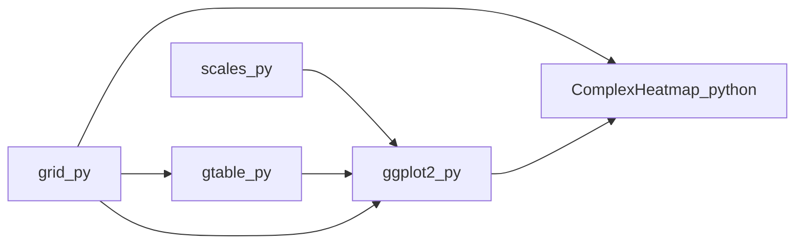

   
  <b>B I O &nbsp;·&nbsp; B A B E L</b>
   
  <i>An AI-assisted community stewarding the classics of bioinformatics — in more than one tongue.</i>
   

  
  
  
  

---

> *"And the whole earth was of one language, and of one speech."*
> — Genesis 11:1
>
> Bioinformatics forgot how. We're learning it again — one classic library at a time.

---

## 🧭 What this is

**Bio-Babel** is an **AI-assisted community** that stewards classic bioinformatics libraries across language ecosystems — closing the gaps one community never quite filled in the other, and **keeping them closed**. Not one-shot ports thrown over a fence, but maintained siblings with the same math, the same edge cases, the same quirks that matter. The work is backed by a private AI tooling stack — still in internal development, not yet open. The libraries it produces are already here.

## 📜 Why "Babel"?

The punishment in the story was never **difference** — diversity of thought is a field's wealth. The punishment was that translation became impossible, and ideas that could have traveled were stranded. Bioinformatics has lived its own small version of that: a beautiful tool blooms on one side of the language line, and half the field that might have used it can't. What changed is that semantic code translation is finally **tractable** — and, more importantly, **maintainable**. Bio-Babel does that work, in the open, one classic library at a time.

## 📚 The Libraries

One worked example — the **visualization stack** — a ground-up reimplementation of R's `grid → gtable / scales → ggplot2 → ComplexHeatmap` chain, carried into pure Python on a Cairo backend. No `matplotlib`. Publication-quality output, by construction.

Beyond this one example, our focus is the **interface between bioinformatics and computation** — creating and maintaining **standardized, language-shared, high-quality libraries** that the field can reach for no matter which language it happens to be working in. More classics will follow as the community nominates them. The full, live catalog lives on the [🏠 organization page](https://github.com/orgs/Bio-Babel/repositories).

> 🔒 **A note on the tooling.** The AI pipeline behind these ports is still in internal development and is **not yet public**. It will be. In the meantime, the libraries it produces are what we're asking you to judge us on.

## ⚙️ How a port gets made

Every port goes through the same loop:

1. 🤖 **AI drafts.** A private pipeline produces an initial port from the canonical source.
2. 👀 **Humans review.** A maintainer shapes the API, rejects mimicry, insists on idioms.
3. ⚖️ **The reference judges.** Outputs are validated against the origin — numerically where possible, visually where not. Divergence is a bug.
4. 🌱 **The community maintains.** When upstream moves, its sibling here moves too.

## 🎯 Principles

The rules we try not to break:

1. **Semantic parity, idiomatic surface.** Behavior trusts the reference; the API feels native to the target language. Not a line-for-line transliteration.
2. **No runtime bridges.** No `rpy2`, no second interpreter — if you can `pip install` it, it works.
3. **Validated against the origin.** Every public function is checked against its reference. Divergence is a bug, not a feature.
4. **Docs and stewardship, first-class.** A port is alive when someone is learning it and someone is maintaining it — every package has a caretaker, not just an author.

## 🤝 Join the community

Bio-Babel is a community as much as it is a codebase. Five ways in, in rough order of commitment:

- 💡 **Nominate a library.** Open an issue on [`Bio-Babel/Bio-Babel`](https://github.com/Bio-Babel/Bio-Babel/issues) with a classic package you wish existed on the other side, and the workflow that's painful without it.
- 🐞 **Report a divergence.** If a port behaves differently from its reference, that's the most valuable bug report we can receive.
- 🔧 **Pick up a port.** Tell us which classic you'd like to help bring over; we'll help you scope it.
- 📖 **Port in public.** Rough drafts welcome — our pipeline assists the draft, but review and stewardship need more hands.
- 🗝️ **Adopt a package.** The scarcest resource here is **long-term maintainers**. If a library matters to your work, consider becoming its caretaker.

## 🚧 Status

Every library in the catalog is currently **under testing** — APIs stabilizing, edges still being filed. Use for verifiable work; tell us when it's wrong & welcome contribution. 

---

<i>The classics, kept alive in more than one tongue.</i>

